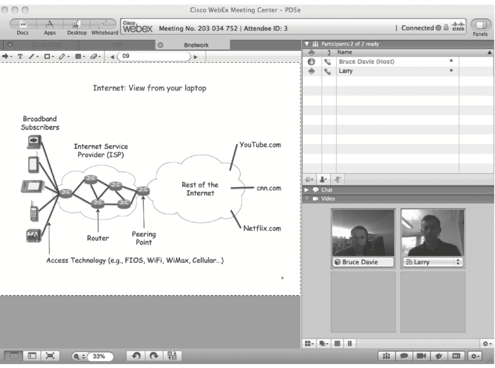

# {{Paj.Toe}}

大多数人通过使用它的应用了解因特网: 万维网, 电子邮件, 在线社交网络, 流媒体音乐和视频, 即时消息, 文件共享,仅举几例. 也就是说,我们作为网络的*用户*与互联网进行交互. 互联网用户可以代表为以某种方式与互联网进行交互的最多的一类人,但还有其他几个重要群体. 

有一群人*创造*应用程序 - 近年来,随着强大的编程平台和诸如智能手机等新设备的出现,应用软件得到了快速发展,也为应用推向大市场创造了新的机会. 

还有一些人*运营*或*管理*网络,虽说主要是幕后工作,但确是关键的一个,且往往是非常复杂的. 随着家庭网络的普及，越来越多的人也成为网络运营商的一小部分. 

最后,就是那些*设计*和*建造*共同组成互联网的设备和协议的人. 最后这类的人是网络教科书的传统目标,并将继续成为我们的主要焦点. 然而,在本书中,我们还会考虑到应用程序开发人员和网络运营员的方面. 

考虑到这些角度,将使我们能够更好地理解网络所必须满足的各种要求. 如果应用程序开发人员理解底层技术的工作方式,和如何与应用程序的交互,他们也能够使应用程序工作得更好. 因此,在开始考虑如何构建网络之前,让我们更仔细地研究一下当今网络支持的应用程序类型. 

## 应用类别

万维网是一种互联网应用,它使互联网从科学家和工程师们经常使用的有点晦涩的工具发展到如今的主流现象. Web本身已经成为一个如此强大的平台,以至于许多人把它与互联网混淆 (如"Interweb") ,并且说Web是单个应用程序有点扯皮. 

在其基本形式中,Web呈现了直观简单的界面. 用户查看充满文本和图形对象的页面,并单击他们想了解更多内容的对象,然后出现相应的新页面. 大多数人还知道,页面上的每个可选对象都绑定到下一个页面或要查看的对象的标识符. 这个标识符称为统一资源定位器 (URL) ,它提供了一种可以从Web浏览器查看,就识别所有可能对象的方法. 例如,

```html
http://www.cs.princeton.edu/llp/index.html
```

这是一个页面的URL,它提供了这本书的作者之一的信息: 字符串`http`指示应使用超文本传输协议 (HTTP) 下载页面,`www.cs.princeton.edu`是为页面提供服务的机器的名称,以及`/llp/index.html`唯一标识`Larry`的这个网站的主页面。

然而,大多数网络用户没有意识到的是,通过单击一个这样的URL,在互联网上就会交换十几条消息,如果网页包含复杂且大量嵌入对象,则更多. 此消息交换包括最多六条消息,从服务器名称 (`www.cs.princeton.edu`) 转换到其因特网协议 (IP) 地址 (`128.112.136.35`) 在您的浏览器和这个服务器之间建立传输控制协议 (TCP) 连接的三条消息,发送HTTP"GET"请求的浏览器和用所请求的页面进行响应的服务器的四条消息 (以及每一方确认收到该消息的消息) ,以及四条断开TCP连接的信息. 当然,这并不包括互联网节点一天中交换的数百万条消息,仅仅为了让彼此知道它们存在,并且准备好提供网页服务,将名称转换为地址,以及将消息转发到最终目的地. 

互联网的另一个广泛应用类别是"流媒体"音频和视频的传送. 视频点播和互联网收音机等服务使用这项技术. 虽然我们经常在网站上启动流媒体会话,但是音频和视频的传递与获取简单的文本和图像网页有一些重要的区别. 例如,你通常不会想在观看视频中第一个场景,就需要下载整个视频文件 - 这个过程可能耗费几分钟到几个小时. 而流媒体音频和视频意味着从发送方到接收方更次序地传输消息,并且在到达接收方时显示视频或播放音频. 

注意,流媒体应用程序与更传统的文本或静止图像页面的传递之间的差别, 在于我们用连续的方式来吃掉音频和视频流,更为重要的是跳过声音或不连续性的停滞的视频形式是不可接受的. 相比之下,一页的文本可以按位传递和读取. 这种差异影响网络如何支持这些不同类别的应用程序. 

一个细微不同的应用类是*即时*音频和视频. 这些应用程序比流媒体应用程序具有更严格的时序约束. 当使用诸如Skype或视频会议应用程序之类的IP语音应用程序时,参与者之间的交互必须是即时的. 当一端的人做出手势时,动作必须尽快在另一端显示. 

> 不是"尽快", 人为因素研究表明,人类在电话呼叫等待时间过长抱怨之前,300毫秒是一个可以容忍多少往返延误的合理上限,而100毫秒的延误听起来就更好了. 

当一个人试图打断另一个人时,被打断的人需要尽快听到,并决定是允许打断还是继续谈论,忽略打断者. 当位于这种环境中,太多的延迟使系统无法使用. 将此与视频点播相比较一下,如果从用户开始视频到显示第一图像需要几秒钟,则就可以认为服务令人满意. 且, 交互式应用程序通常需要在两个方向上都包含音频 和/或 视频流,而流媒体应用程序很可能只在一个方向上发送视频或音频. 

<figure class="line">
	<a id="vic"></a>
	
	<figcaption>视频会议在内的多媒体应用程序</figcaption>
</figure>
自20世纪90年代初以来,通过互联网运行的视频会议工具已经存在,但在过去几年中,随着更高的网络速度和更强大的计算机已经变得普遍,视频会议工具已经得到了更广泛的使用. 一个这样的系统的例子显示在[图1](#vic). 就像下载一个网页所涉及的不仅仅是视觉应用,视频应用也是如此. 例如考虑,将视频内容放入相对较低的带宽网络中,或者确保视频和音频保持同步并及时到达以获得良好的用户体验,这些都是网络和协议设计者必须担心的问题. 我们将在书后面,查看这些和许多其他与多媒体应用相关的问题. 

虽然它们只是两个例子,但是从网上下载页面和参加视频会议展示了可以在互联网上构建的应用程序的多样性,并暗示了互联网设计的复杂性. 在书的后面,我们将开展一个更完整的应用程序类型分类,用来帮助和指导我们对关键设计决策的讨论, 因为我们试图构建,运营和使用如此广泛的应用程序. 在第9章中,本书通过重温这两个特定的应用程序,以及几个其他的应用程序来结束本文,这些应用程序说明了当今互联网上可能存在的广度. 

现在,快速查看几个典型的应用程序, 就足以使我们能够开始研究 - 如果要构建支持这种应用程序多样性的网络所必须解决的问题. 
