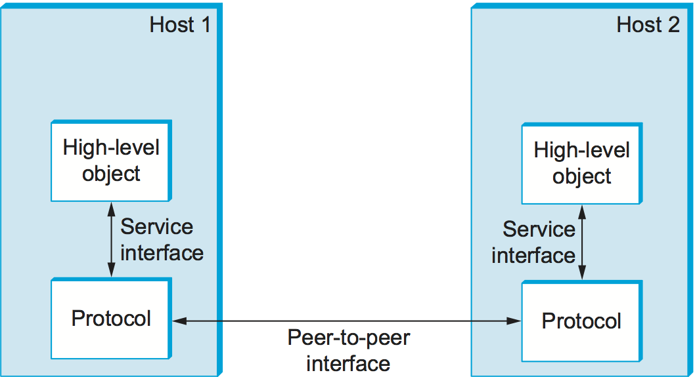
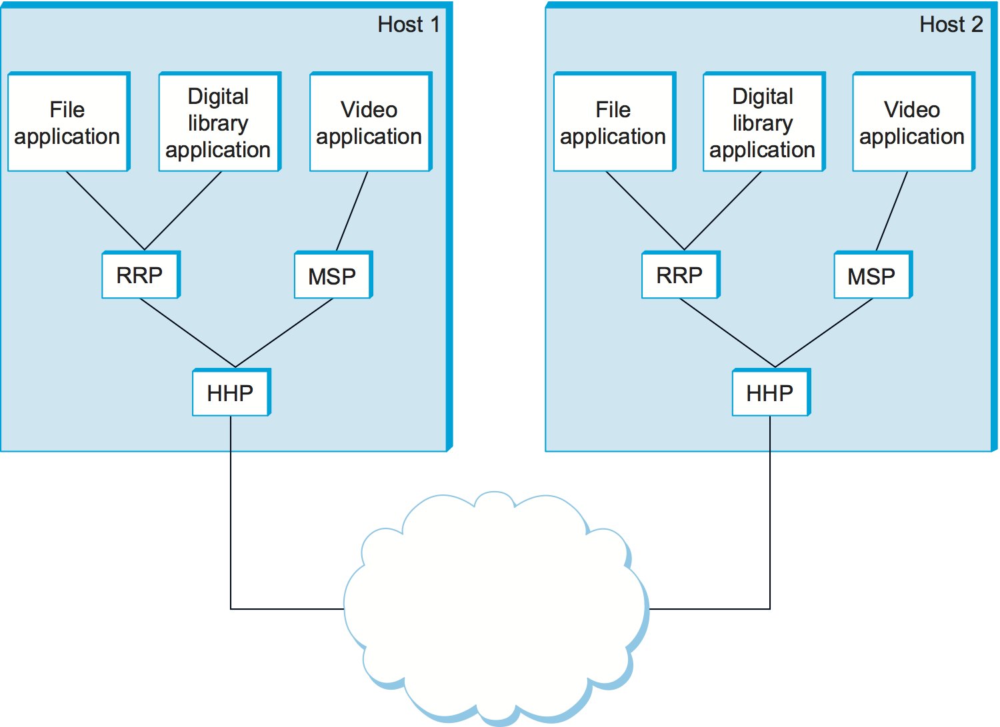
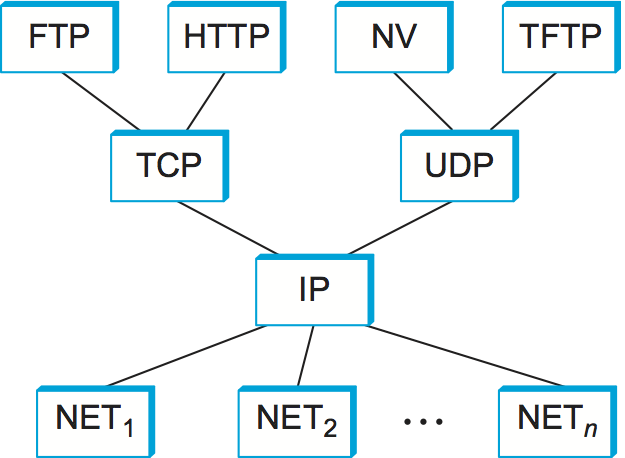

# {{Paj.Toe}}

如果您没有注意到,前面的部分为网络设计建立了一组相当可观的要求ℴℴ计算机网络必须提供大量计算机之间的通用ㄡ成本效益ㄡ公平和健壮的连接. 似乎这还不够,网络在任何时间点都不是固定的,而是必须演进以适应它们所基于的底层技术的变化以及应用程序对它们的需求的变化. 此外,网络必须由不同技能水平的人来管理. 设计满足这些要求的网络是一项不小的任务. 

为了帮助处理这种复杂性,网络设计者已经开发了通常被称为的一般蓝图. *网络体系结构*-指导网络的设计和实现. 本节通过介绍所有网络体系结构共有的中心思想来更仔细地定义我们所说的网络体系结构. 它还介绍了两个最广泛引用的体系结构ℴℴOSI (或7层) 体系结构和Internet体系结构. 

## 分层与协议

抽象ℴℴ在定义良好的接口后面隐藏细节ℴℴ是系统设计人员用来管理复杂性的基本工具. 抽象的概念是定义一个模型,该模型可以捕获系统的某些重要方面,将该模型封装在一个对象中,该对象提供可以由系统的其他组件操纵的接口,并且向对象. 挑战在于识别同时提供在大量情况下证明有用并且可以在底层系统中高效实现的服务的抽象. 这正是我们在前一节介绍通道概念时所做的工作: 我们为应用程序提供一个抽象,它向应用程序编写人员隐藏了网络的复杂性. 

<figure class="line">
	
	
	<figcaption>Example of a layered network system.</figcaption>
</figure>

抽象自然导致分层,特别是在网络系统中. 一般思想是从底层硬件提供的服务开始,然后添加一系列层,每个层提供更高 (更抽象) 的服务级别. 在高层提供的服务是由低层提供的服务来实现的. 例如,根据前面部分给出的需求讨论,我们可以想象一个简单的网络具有两层抽象,夹在应用程序和底层硬件之间,如下所示[图1](#layers1). 在这种情况下,紧挨硬件上方的层可以提供主机到主机的连接,从而抽象出任意两个主机之间可能存在任意复杂的网络拓扑的事实. 下一层构建在可用的主机到主机通信服务之上,并提供对进程到进程通道的支持,从而抽象出网络偶尔丢失消息的事实,例如. 

分层提供了两个很好的特点. 首先,它将构建网络的问题分解成更易于管理的组件. 您可以实现几个层,每个层都解决一部分问题,而不是实现一个完成所有您想要的事情的单块软件. 第二,它提供了更模块化的设计. 如果您决定要添加一些新服务,那么您可能只需要修改一个层的功能,重用所有其他层提供的功能. 

然而,把系统看作是线性层序的想法过于简单化了. 很多时候,在系统的任何给定级别上都提供了多个抽象,每个抽象都为较高层提供不同的服务,但是构建在相同的低级抽象之上. 要了解这一点,请考虑前一节中讨论的两种类型的通道. 一个提供请求/应答服务,一个支持消息流服务. 这两个通道可能是多级网络系统的某个层次上的替代产品,如[图2](#layers2).

<figure class="line">
	
	
	<figcaption>Layered system with alternative abstractions available
	at a given layer.</figcaption>
</figure>

使用分层的讨论作为基础,我们现在准备更精确地讨论网络的体系结构. 首先,构成网络系统层的抽象对象被称为*协议*. 也就是说,协议提供高层对象 (例如应用程序进程或者更高层协议) 用来交换消息的通信服务. 例如,我们可以设想支持请求/应答协议和消息流协议的网络,对应于上面讨论的请求/应答和消息流信道. 

每个协议定义了两个不同的接口. 首先,它定义了一个*服务接口*在同一台计算机上的其他对象,希望使用它的通信服务. 此服务接口定义本地对象可以在协议上执行的操作. 例如,请求/应答协议将支持应用程序可以通过其发送和接收消息的操作. HTTP协议的实现可以支持从远程服务器获取超文本页面的操作. 当浏览器需要获得新页面时 (例如,当用户单击当前显示的页面中的链接时) ,诸如web浏览器之类的应用程序将调用这样的操作. 

其次,协议定义了*对等接口*在另一台机器上. 第二个接口定义了协议对等点之间交换的消息的形式和意义,以实现通信服务. 这将决定一台机器上的请求/应答协议与另一台机器上的对等体通信的方式. 例如,在HTTP的情况下,协议规范详细定义了*得到*命令是格式化的,命令可以使用什么参数,以及web服务器在接收到这样的命令时应该如何响应. 

综上所述,协议定义了它本地导出的通信服务 (服务接口) ,以及控制协议与其对等方交换以实现该服务 (对等接口) 的消息的一组规则. 这种情况在[图3](#interfaces).

<figure class="line">
	
	
	<figcaption>Service interfaces and peer interfaces.</figcaption>
</figure>
 
Except at the hardware level, where peers directly communicate with each
other over a link, peer-to-peer communication is indirect—each
protocol communicates with its peer by passing messages to some
lower-level protocol, which in turn delivers the message to *its* peer.
In addition, there are potentially multiple protocols at any given
level, each providing a different communication service. We therefore
represent the suite of protocols that make up a network system with a
*protocol graph*. The nodes of the graph correspond to protocols, and
the edges represent a *depends on* relation. For example,
[Figure 4](#protgraph) illustrates a protocol graph for the hypothetical
layered system we have been discussing—protocols RRP (Request/Reply
Protocol) and MSP (Message Stream Protocol) implement two different
types of process-to-process channels, and both depend on the
Host-to-Host Protocol (HHP) which provides a host-to-host connectivity
service.

<figure class="line">
	
	
	<figcaption>Example of a protocol graph.</figcaption>
</figure>

在此示例中,假设主机1上的文件访问程序希望使用RRP提供的通信服务向主机2上的对等方发送消息. 在这种情况下,文件应用程序要求RRP代表其发送消息. 为了与其对等方通信,RRP调用HHP的服务,HHP又将消息发送到另一台机器上的对等方. 一旦消息到达主机2上的HHP实例,HHP将消息传递到RRP,RRP又将消息传递到文件应用程序. 在这种特殊情况下,应用程序被称为使用*协议栈*RRP/HHP. 

注意这个词*协议*用两种不同的方式. 有时它指的是抽象接口,即由服务接口定义的操作和对等体之间交换的消息的形式和意义,有时它指的是实际实现这两个接口的模块. 为了区分接口和实现这些接口的模块,我们通常将前者称为*协议规范*. 规范通常使用散文ㄡ伪代码ㄡ状态转换图ㄡ分组格式的图片和其他抽象符号的组合来表示. 应该存在这样的情况,即给定的协议可以由不同的程序员以不同的方式实现,只要每个程序员都遵守规范. 挑战在于确保同一规范的两种不同实现可以成功地交换消息. 据说,两个或多个协议协议模块能够准确地实现协议规范. *互操作*彼此. 

我们可以想象出许多不同的协议和协议图,它们满足一组应用程序的通信需求. 幸运的是,存在为特定协议图建立策略的标准化机构,例如因特网工程任务组 (IETF) 和国际标准组织 (ISO) . 我们调用规则图A的形式和内容的规则集. *网络体系结构*. 尽管超出了本书的范围,标准化机构已经建立了定义良好的过程,用于在各自的体系结构中引入ㄡ验证和最终批准协议. 我们简要地描述了由IETF和ISO定义的体系结构,但是首先需要解释关于协议分层机制的另外两件事. 

## 包封

考虑当应用程序中的一个通过向RRP传递消息向其对等体发送消息时会发生什么. 从RRP的角度来看,应用程序给出的消息是一个未解释的字节串. RRP并不关心这些字节表示整数组ㄡ电子邮件消息ㄡ数字图像或其他任何内容;它只需要将它们发送到对等节点. 然而,RRP必须将控制信息传送给它的对等体,指示它在接收到消息时如何处理该消息. RRP通过附加*页眉*给信息. 一般来说,报头是一种小的数据结构,从几个字节到几十个字节,用于对等点之间相互通信. 顾名思义,报头通常连接到消息的前面. 然而,在某些情况下,这种对等控制信息在消息的末尾被发送,在这种情况下,它被称为"消息". *拖车*. 由RRP附加的报头的确切格式是由其协议规范定义的. 消息的其余部分,即代表应用程序传输的数据称为消息. *身体*或*有效载荷*. 我们说应用程序的数据是*包封的*在RRP创建的新消息中. 

<figure class="line">
	
	
	<figcaption>High-level messages are encapsulated inside of low-level messages.</figcaption>
</figure>
 
This process of encapsulation is then repeated at each level of the
protocol graph; for example, HHP encapsulates RRP's message by attaching
a header of its own. If we now assume that HHP sends the message to its
peer over some network, then when the message arrives at the destination
host, it is processed in the opposite order: HHP first interprets the
HHP header at the front of the message (i.e., takes whatever action is
appropriate given the contents of the header) and passes the body of the
message (but not the HHP header) up to RRP, which takes whatever action
is indicated by the RRP header that its peer attached and passes the
body of the message (but not the RRP header) up to the application
program. The message passed up from RRP to the application on host 2 is
exactly the same message as the application passed down to RRP on
host 1; the application does not see any of the headers that have been
attached to it to implement the lower-level communication services. This
whole process is illustrated in [Figure 5](#encapsulation). Note
that in this example, nodes in the network (e.g., switches and
routers) may inspect the HHP header at the front of the message.

注意,当我们说低级协议不解释由某些高级协议给出的消息时,我们的意思是它不知道如何从消息中包含的数据中提取任何含义. 然而,有时低级协议对给定的数据应用一些简单的转换,例如压缩或加密. 在这种情况下,协议将转换消息的整个主体,包括原始应用程序的数据和通过高级协议附加到该数据的所有头. 

## 多路复用与解复用

回想起来,分组交换的一个基本思想是在一个物理链路上复用多个数据流. 这个相同的概念在协议图上应用,而不仅仅是交换节点. 在[图4](#protgraph)例如,我们可以将RRP看作实现逻辑通信信道,其中来自两个不同应用程序的消息在源主机上通过该信道复用,然后在目的地主机上解复用回到适当的应用程序. 

实际上,这仅仅意味着RRP附加到其消息的头部包含一个标识符,该标识符记录消息所属的应用程序. 我们把这个标识符称为RRP. *多路分解键*或*解复用键*简而言之. 在源主机上,RRP在其头中包含适当的DEMUX密钥. 当消息被传递到目标主机上的RRP时,它将剥离其头部,检查解复用密钥,并将消息解复用到正确的应用程序. 

RRP不是唯一的支持复用的协议;几乎所有协议都实现了这种机制. 例如,HHP有自己的DIMUX密钥来确定传递给RRP的哪些消息,哪些消息传递到MSP. 然而,协议之间,甚至在单个网络架构内的协议之间,对于什么是解复用密钥,并没有统一的协议. 有些协议使用8位字段 (意味着它们只能支持256种高级协议) ,而另一些则使用16位或32位字段. 此外,有些协议在其报头中有一个单独的解复用字段,而另一些协议具有一对解复用字段. 在前一种情况下,通信双方使用相同的解复用密钥,而在后一种情况下,每一方使用不同的密钥来标识要向其传递消息的高级协议 (或应用程序) . 

## 7层OSI模型

ISO是正式定义连接计算机的常用方法的第一个组织之一. 他们的建筑,叫做*开放系统互连* (OSI) 体系结构并说明[图6](#osi)将网络功能划分为七层,其中一个或多个协议实现分配给给定层的功能. 在这个意义上,给出的示意图不是协议图,*本身*更确切地说是*参考模型*对于协议图. 它通常被称为7层模型. 

<figure class="line">
	
	
	<figcaption>The OSI 7-layer model.</figcaption>
</figure>

从底部开始工作,*身体的*层处理原始比特在通信链路上的传输. 这个*数据链路*层然后将一个比特流收集到一个称为*框架*. 网络适配器,以及运行在节点操作系统中的设备驱动程序,通常实现数据链路级别. 这意味着帧,而不是原始位,实际上是传递给主机的. 这个*网络*层处理分组交换网络内的节点之间的路由. 在该层中,节点间交换的数据单元通常称为*小包裹*而不是框架,尽管它们基本上是相同的. 下三层在所有网络节点上实现,包括网络内的交换机和连接到网络外部的主机. 这个*运输*层然后实现我们一直到这一点的调用*处理通道的过程*. 这里,交换的数据单元通常称为*消息*而不是一个包或一个框架. 传输层和更高层通常只在终端主机上运行,而不在中间交换机或路由器上运行. 

对于前三层的定义不太一致,部分原因是它们并不总是存在,我们将在下面看到. 跳过到顶部 (第七) 层,我们发现*应用*层. 应用层协议包括诸如超文本传输协议 (HTTP) 之类的东西,它是万维网的基础,并且使web浏览器能够从web服务器请求页面. 在下面,*演示*层涉及对等体之间交换的数据的格式,例如,整数是16ㄡ32还是64位长,最高有效字节是先传输还是最后传输,或者视频流是如何格式化的. 最后,*阶段*层提供名称空间,用于将作为单个应用程序的一部分的潜在不同传输流绑定在一起. 例如,它可以管理在电信会议应用中被组合的音频流和视频流. 

## 互联网体系结构

因特网体系结构有时也被称为TCP/IP体系结构,在其两个主要协议之后被描述. [图7](#internet1). 给出了另一种表示形式. [图8](#internet2). 因特网体系结构是由早期的分组交换网络称为ARPANET的经验演变而来的. 互联网和ARPANT都由美国国防部的研究和发展资助机构之一的高级研究计划署 (ARPA) 资助. 在OSI架构之前,Internet和ARPANNET就已经存在,构建它们的经验对OSI参考模型有很大的影响. 

<figure class="line">
	
	
	<figcaption>Internet protocol graph.</figcaption>
</figure>

<figure class="line">
	
	
	<figcaption>Alternative view of the Internet architecture. The "subnetwork" layer
    was historically referred to as the "network" layer and is now often
    referred to as "layer 2."</figcaption>
</figure>

虽然7层OSI模型可以在某种程度上被应用于互联网,但通常使用四层模型. 在最低级别是各种各样的网络协议,表示$$1 $ $$,净$$2$ $,等等. 在实践中,这些协议通过硬件(例如,网络适配器)和软件(例如,网络设备驱动程序)的组合来实现. 例如,您可以在这个层找到以太网或无线协议 (例如802.11个Wi-Fi标准) .  (这些协议反过来可能实际上涉及几个子层,但是因特网体系结构并不假定它们有任何关系. ) *互联网协议* (IP) . 这是支持多个网络技术互连到单个逻辑互连网络的协议. 第三层包含两个主要协议*传输控制协议* (TCP) 和*用户数据报协议* (UDP) . TCP和UDP为应用程序提供了可选的逻辑通道: TCP提供可靠的字节流通道,UDP提供不可靠的数据报传递通道 (*数据报*可能被认为是信息的同义词. 在互联网语言中,有时称TCP和UDP. *端对端*协议,尽管将它们称为*运输*协议. 

在传输层之上运行的是一系列应用程序协议,如HTTPㄡFTPㄡTelnet (远程登录) 和简单邮件传输协议 (SMTP) ,它们支持流行应用程序的互操作. 要理解应用层协议和应用程序之间的差异,请考虑所有可用的或已经可用的不同万维网浏览器 (例如,FirefoxㄡSafariㄡNetscapeㄡMosaicㄡInternet Explorer) . 同样有大量不同的Web服务器实现. 您可以使用这些应用程序中的任何一个来访问Web上的特定站点,原因在于它们都遵循相同的应用程序层协议: HTTP. 令人困惑的是,这个术语有时同时适用于应用程序及其使用的应用层协议 (例如,FTP经常用作实现FTP协议的应用程序的名称) . 

活跃于网络领域的大多数人都熟悉Internet体系结构和7层OSI体系结构,并且对于体系结构之间的层映射方式达成了一致意见. 因特网的应用层被认为是在第7层,其传输层是第4层,IP(互联网或只是网络)层是第3层,IP下面的链路或子网层是第2层. 

互联网体系结构有三个值得突出的特点. 首先,最好说明[图8](#internet2)互联网架构并不意味着严格的分层. 该应用程序可以自由地绕过定义的传输层,并直接使用IP或底层网络之一. 事实上,程序员可以自由定义新的信道抽象或应用程序,这些应用程序运行在现有协议的任何一个之上. 

第二,如果您仔细查看协议图中的[图7](#internet1)你会注意到沙漏形状在顶部宽,中间窄,底部宽. 这种形状实际上反映了建筑的中心哲学. 也就是说,IP是该体系结构的焦点ℴℴ它定义了在广泛的网络集合之间交换分组的常用方法. 在IP之上,可以有任意多个传输协议,每个协议为应用程序提供不同的通道抽象. 因此,将消息从主机传递到主机的问题与提供有用的进程间通信服务的问题完全分开. 在IP之下,该架构允许任意多种不同的网络技术,从以太网到无线到单点到点链接. 

Internet体系结构 (或者更准确地说,IETF文化) 的最后一个属性是,为了使新协议被正式包括在体系结构中,必须有协议规范和至少一个 (最好是两个) 具有代表性的指定实现阳离子. IETF采用的标准需要工作实现的存在. 设计社区的这种文化假设有助于确保体系结构的协议可以有效地实现. 也许互联网文化对工作软件的价值最好通过IETF会议上常穿的T恤上的一句话来体现: 

> *我们拒绝国王ㄡ总统和投票. 我们相信粗略的共识和运行代码. * ** (David Clark) **

这三个属性的互联网架构,沙漏的设计理念是重要的,足以承担重复. 沙漏的窄腰代表了一组最小的ㄡ经过精心选择的全局能力,它允许更高级别的应用程序和低级别的通信技术共存ㄡ共享能力和快速演进. 狭窄的腰围模式对互联网迅速适应新用户需求和改变技术的能力至关重要. 
