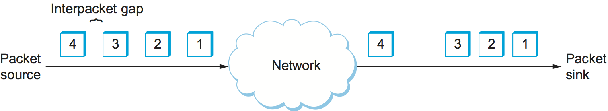

# {{Paj.Toe}}

到目前为止,我们主要集中在网络的功能方面. 然而,与任何计算机系统一样,计算机网络也会表现良好. 这是因为分布在网络上的计算的有效性通常直接取决于网络传输计算数据的效率. 而旧的编程格言"先得到它的权利,然后再让它跑得快"是有效的在许多设置,网络需要"性能设计". 因此,了解影响网络性能的各种因素. 

## 带宽和延迟

网络性能的测量有两种基本方法: *带宽* (也称为*吞吐量*) *等待时间* (也称为*延迟*) 网络的带宽由在一定时间内通过网络传输的比特数给出. 例如,一个网络可能有一个带宽为1000万比特/秒 (Mbps) ,这意味着它能够提供10 百万比特每秒. 有时考虑到传输每一比特数据需要多长时间,这是有用的. 例如,在一个10 Mbps的网络上,传输每个比特需要0.1微秒 ($$MU $ S) . 

带宽和吞吐量是细微不同的术语. 首先,带宽实际上是频带宽度的量度. 例如,一个语音级电话线支持频段范围从300 300 赫兹;它是说有一个带宽为3300 Hz - 300 Hz = 3000Hz. 如果你看到这个词*带宽*用于以赫兹进行测量的情况,那么它可能指的是可以容纳的信号范围. 

当我们谈论通信链路的带宽时,我们通常指的是链路上每秒可传输的比特数. 这有时也被称为*数据速率. *我们可以说以太网链路的带宽是10μMbps. 然而,在链路上可用的最大数据速率和实际上我们可以通过链路实际传输的每秒比特数之间也可以作出有用的区分. 我们倾向于使用这个词*吞吐量*指的是*实测性能*一个系统的因此,由于实现的各种低效率,通过带宽为10Mbps的链路连接的一对节点可能仅达到2Mbps的吞吐量. 这意味着一个主机上的应用程序可以在2μMbps上向另一主机发送数据. 

最后,我们经常谈论带宽. *要求*一个应用程序. 这是每秒需要通过网络传输的比特数,以便可接受地执行. 对于一些应用程序,这可能是"我能得到的任何东西";对于其他应用程序,可能是某个固定号码 (最好不超过可用链路带宽) ;而对于其他应用程序,可能是一个随时间变化的号码. 稍后我们将在本节中提供更多关于这个主题的内容. 

虽然您可以讨论整个网络的带宽,但有时您希望更精确,例如,关注单个物理链路或逻辑进程到进程通道的带宽. 在物理层面上,带宽不断提高,没有尽头. 直觉上,如果你把秒看作一个距离,你可以用一把尺子和带宽来测量这个距离中适合多少位,那么你可以把每个位看作一个宽度一定的脉冲. 例如,1-Mbps链接上的每个位是1$mu$$s宽,而2-Mbps链接上的每个位是0.5$mu$$s宽,如下所示[图1](#bit-width). 发射和接收技术越复杂,每个比特可以变得越窄,从而带宽越高. 对于逻辑进程到进程通道,带宽也受到其他通道的影响,包括实现通道的软件必须处理和可能转换每个数据位的次数. 

<figure class="line">
	<a id="bit-width"></a>
	
	<figcaption>Bits transmitted at a particular bandwidth can be
	regarded as having some width: (a) bits transmitted at 1 Mbps
	(each bit is 1 microsecond wide); (b) bits transmitted at 2 Mbps
	(each bit is 0.5 microseconds wide).</figcaption>
</figure>

第二个性能度量,延迟,对应于消息从网络的一端到另一端需要多长时间.  (和带宽一样,我们可以关注单个链路或端到端信道的延迟. ) 延迟是严格按照时间测量的. 例如,横贯大陆的网络可能具有24毫秒(ms)的延迟,也就是说,从北美的一个海岸到另一个海岸需要24ms的消息. 在许多情况下,了解从网络的一端向另一端和向后发送消息需要多长时间比单向延迟更重要. 我们称之为*往返时间* (RTT) 的网络. 

我们通常认为潜伏期有三个组成部分. 首先,有光传播延迟的速度. 这种延迟发生是因为没有任何东西,包括电线上的一点,可以比光速传播得更快. 如果你知道两点之间的距离,你就可以计算光速延迟,尽管你必须小心,因为光以不同的速度穿越不同的介质: 在真空中以3.0美元$乘以$10$8$m/s,在真空中以2.3美元$乘以$10$8$m/s,在铜线中以2.0美元$8$m/s. 光纤中的时间是10美元$^ 8美元$m/s. 第二,传输一个数据单元需要花费的时间. 这是网络带宽和携带数据的数据包的大小的函数. 第三,网络内部可能存在排队延迟,因为分组交换机通常在将分组转发到出站链路上之前需要将分组存储一段时间. 因此,我们可以定义总潜伏期为

```c
Latency = Propagation + Transmit + Queue
Propagation =  Distance/SpeedOfLight
Transmit = Size/Bandwidth
```

哪里`Distance`是数据传输的导线长度,`SpeedOfLight`是光在那根电线上的有效速度,`Size`是数据包的大小,以及`Bandwidth`是传输数据包的带宽. 请注意,如果消息只包含一个比特,而我们所讨论的是单个链路 (而不是整个网络) ,那么`Transmit`和`Queue`术语不相关,并且延迟仅对应于传播延迟. 

带宽和延迟组合以定义给定链路或信道的性能特征. 然而,它们的相对重要性取决于应用. 对于某些应用,延迟占主导地位的带宽. 例如,向服务器发送1字节消息并返回1字节消息的客户端是延迟绑定的. 假设在准备响应时不涉及任何认真的计算,应用程序在具有100毫秒RTT的跨大陆信道上的性能与在具有1毫秒RTT的跨房间信道上的性能大不相同. 然而,信道是1Mbps还是100Mbps相对来说并不重要,因为前者意味着传输字节的时间(`Transimt`是8美元$MU$$S,后者意味着`Transmit`= 0.08美元$MU $ S.

相比之下,考虑一个要求获取25兆字节 (MB) 图像的数字图书馆程序ℴℴ可用的带宽越大,它向用户返回图像的速度就越快. 这里,信道的带宽支配性能. 为了看到这一点,假设信道具有10μMbps的带宽. 传输图像需要20秒 (25$乘以$10$$^6乘以$8-bits/ (10$乘以$$10$^6$$Mbps=20秒) ,如果图像位于1ms通道或100ms通道的另一侧,则相对不重要;20.001秒的响应时间与20秒之间的差异. 1秒响应时间可以忽略不计. 

<figure class="line">
	<a id="latency"></a>
	
	<figcaption>Perceived latency (response time) versus round-trip
	time for various object sizes and link speeds.</figcaption>
</figure>

[图2](#latency)在不同的情况下,你可以感觉到延迟或带宽如何支配性能. 该图显示了在RTT从1到100ms以及链路速度为1.5或10Mbps的网络上移动不同大小(1字节ㄡ2KBㄡ1MB)的对象需要多长时间. 我们使用对数尺度来显示相对性能. 对于一个1字节的对象 (例如,击键) ,延迟几乎与RTT完全相同,因此无法区分1.5Mbps网络和10Mbps网络. 对于2KB对象 (例如,电子邮件消息) ,链路速度在1-ms RTT网络上有很大差异,但是在100-ms RTT网络上差异可以忽略不计. 对于1MB的对象 (例如,数字图像) ,RTT没有区别ℴℴ在整个RTT范围内,是链路速度主导性能. 

请注意,贯穿本书,我们使用术语. *等待时间*和*延迟*用一种通用的方式来表示执行一个特定函数需要多长时间,例如传递消息或移动对象. 当我们提到一个信号从一个链路的一端传播到另一端所需的特定时间量时,我们使用*传播延迟*. 此外,我们在讨论的上下文中清楚地表明我们是指单向延迟还是往返时间. 

作为旁白,计算机正变得如此之快,以至于当我们将它们连接到网络时,有时,至少以比喻的方式思考*每英里指令数*. 考虑当能够每秒执行10亿条指令的计算机在具有100ms RTT的信道上发送消息时会发生什么.  (为了简化数学计算,假设该消息覆盖5000英里的距离. ) 如果该计算机闲置了整整100毫秒等待回复消息,那么它就丧失了每英里执行1亿条指令或20000条指令的能力. 最好是通过网络来证明这种浪费是正当的. 

## 延迟X带宽积

讨论这两个度量的乘积也是有用的,通常称为*延迟*$$$$$*带宽乘积*. 直观地说,如果我们认为一对过程之间的通道是一个空心管道 (参见[图3](#pipe)其中,延迟对应于管道的长度,而带宽给出管道的直径,则延迟$乘以$带宽乘积给出管道的体积,即任何给定时刻可以通过管道传输的最大位数. 换句话说,如果延迟 (以时间度量) 对应于管道的长度,那么给定每个比特的宽度 (也以时间度量) ,您可以计算管道中适合多少比特. 例如,具有50毫秒的单向延迟和45 Mbps的带宽的跨大陆信道能够保持. 

$ 50倍\\ 10 ^ { 3 }秒/次45次10 ^ 6比特/秒=2.25倍10 ^ 6比特$$

或大约280 kb的数据. 换言之,这个示例通道 (管道) 容纳的字节数与上世纪80年代早期的个人计算机的存储器所能容纳的字节数一样多. 

<figure class="line">
	<a id="pipe"></a>
	
	<figcaption>Network as a pipe.</figcaption>
</figure>

在建立高性能网络时,延迟$乘以$$带宽积很重要,因为它对应于在第一位到达接收器之前发送者必须发送多少位. 如果发送方希望接收器以某种方式发出比特开始到达的信号,并且该信号需要另一个信道延迟才能传播回发送方,那么发送方可以发送一个*RTT*$$$$$*带宽*值得一提的数据在收听前听得很好. 管道中的位被称作"在飞行中",这意味着如果接收器告诉发送方停止发送,那么在发送方设法作出响应之前,它可能接收到最多一个RTT$乘以$带宽的数据. 在上面的示例中,该金额对应于5.5 $ $\\倍$ 10 $ $^ 6 $ $位 (671×kb) 的数据. 另一方面,如果发送方没有填充管道,则在它停止等待信号之前发送整个RTT$乘以$带宽产品的数据,发送方将不能充分利用网络. 

请注意,大多数时候我们对RTT场景感兴趣,我们简单地将其称为延迟$times$$带宽乘积,而不明确表示"延迟"是RTT (即,单向延迟2) . 通常情况下,延迟的$$\\倍$ $带宽的"延迟"是否意味着单向延迟或RTT是由上下文明确的. [表1](#delay-bw)展示了一些典型网络链接的RTT $$$乘以$$产品的例子. 

<a id="delay-bw"></a>

|  链接类型 |    带宽   |   单程距离  |      RTT     | RTT X带宽 |
| :---: | :-----: | :-----: | :----------: | :-----: |
|   拨号  | 56 kbps |   10公里  |  87美元$MU $S  |    5位   |
| 无线局域网 | 54 Mbps |   50米   | 0.33美元$MU $S |   18位   |
|   卫星  | 45 Mbps | 35000公里 |     230毫秒    |  10兆字节  |
|  越野纤维 | 10 Gbps |  4000公里 |     40毫秒     |  400兆字节 |

*表1. 示例延迟X带宽产品. *

## 高速网络

当今网络上可用的带宽正以惊人的速度增长,并且人们永远乐观地认为网络带宽将继续改善. 这导致网络设计者开始思考在极限中发生了什么,或者换句话说,具有无限可用带宽对网络设计的影响是什么. 

尽管高速网络给应用程序带来了带宽上的巨大变化,但在许多方面,它们对我们如何看待网络有何影响?*不*随着带宽的增加,光的速度也随之改变. 引用Scotty*星际迷航,*"你们可以改变物理定律. "换句话说,"高速"并不意味着延迟以与带宽相同的速率提高;1-Gbps链路的跨大陆RTT与1-Mbps链路的100ms相同. 

为了理解在固定延迟情况下不断增长的带宽的重要性,考虑在1-Mbps网络上传输1-MB文件所需要的条件,而不是在1-Gbps网络上传输1-MB文件,这两种网络都具有100ms的RTT. 在每个RTT期间,发送文件的1.25%. 相比之下,相同的1-MB文件甚至没有接近于填充1RTT的1-Gbps链路,其延迟x带宽乘积为12.5MB. 

[图4](#bw-lat)说明这两个网络之间的差异. 实际上,1-MB文件看起来像需要通过1-Mbps网络传输的数据流,而它看起来像1-Gbps网络上的单个分组. 为了帮助驱动这一点,考虑一个1-MB文件是一个1-GbPS网络,一个1-KB*小包裹*是一个1-MbPS网络. 

<figure class="line">
	<a id="bw-lat"></a>
	
	<figcaption>Relationship between bandwidth and latency. A 1-MB
	file would fill the 1-Mbps link 80 times but only fill 1/12th of a
	1-Gbps link.</figcaption>
</figure>

考虑这种情况的另一种方式是在高速网络上的每个RTT期间可以发送更多的数据,以至于单个RTT成为大量的时间. 因此,虽然您不会再三考虑采用101RTT而不是100RTT的文件传输之间的差异 (仅1%的相对差异) ,但是突然之间,1RTT和2RTT之间的差异是显著的ℴℴ100%的增加. 换句话说,延迟,而不是吞吐量,开始主导我们对网络设计的思考. 

也许理解吞吐量和延迟之间的关系的最好方法是回到基础. 通过简单的关系给出了在网络上可以实现的有效端到端吞吐量. 

 TimeTime=传输大小/传输时间

其中不仅包括本节前面识别的单向元素,还包括请求或设置传输所花费的任何额外时间. 一般来说,我们把这种关系表示为

传输时间=RTT+ 1 /带宽x传输大小

在这个计算中,我们使用一个请求消息,通过网络发送数据,并将数据发送回. 例如,考虑这样的情况,用户希望在往返时间为100ms的1Gbps上获取1MB的文件. 这包括1MB (1/1Gbps$乘以$1MB=8ms) 的传输时间和总传输时间为108ms的100ms RTT. OrdPoT将

 1 Mb/ms 108=74.1 Mbps 

不是1μgbps. 显然,传输大量数据将有助于提高有效吞吐量,其中无限大的传输大小将导致有效吞吐量接近网络带宽. 另一方面,必须忍受超过1个RTTℴℴ例如,重传丢失的分组ℴℴ将损害有限大小的任何传输的有效吞吐量,并且对于小传输将最为明显. 

## 应用性能需求

本节中的讨论采用了以网络为中心的性能观点;也就是说,我们讨论了给定链接或信道将支持的内容. 未说明的假设是应用程序具有简单的需求ℴℴ它们希望网络能够提供的带宽尽可能多. 上述检索25MB图像的数字图书馆程序确实如此;可用带宽越大,程序将能够更快地将图像返回给用户. 

然而,一些应用能够规定它们需要多少带宽的上限. 视频应用就是一个最好的例子. 假设一个视频流的大小是标准电视屏幕的四分之一,也就是说,它的分辨率是352×240像素. 如果每个像素由24位信息表示,如24位颜色的情况,那么每个帧的大小将是

$ (352倍240次24) / 8=247.5 KB $

如果应用程序需要支持每秒30帧的帧速率,那么它可能要求吞吐量为75 Mbps. 网络提供更多带宽的能力对这种应用不感兴趣,因为它在给定时间段内只有这么多数据要发送. 

不幸的是,情况并不像这个例子所暗示的那么简单. 由于视频流中任意两个相邻帧之间的差异通常很小,因此可以通过仅传输相邻帧之间的差异来压缩视频. 每个帧也可以被压缩,因为图像中的所有细节都不容易被人眼感知到. 压缩的视频不是以恒定的速率流动,而是根据诸如图片中的动作量和细节以及所使用的压缩算法等因素随时间而变化. 因此,有可能说出平均带宽需求将是什么,但是瞬时速率可以或多或少. 

关键问题是计算平均值的时间间隔. 假设这个示例视频应用程序可以被压缩到平均只需要2μMbps的点. 如果它在1秒间隔内传输1兆比特,而在随后的1秒间隔内传输3兆比特,则在2秒间隔内以2Mbps的平均速率传输;然而,这对于一个被设计为在一个一秒钟. 显然,仅仅知道应用程序的平均带宽需求并不总是足够的. 

然而,一般来说,可以对像这样的应用程序可能传输的大脉冲加上上限. 一个突发可以通过维持一定时间段的一些峰值速率来描述. 或者,它可以被描述为在恢复到平均速率或更低速率之前可以以峰值速率发送的字节数. 如果这个峰值速率高于可用信道容量,那么多余的数据将不得不在某个地方进行缓冲,以便稍后传输. 知道发送的突发有多大,允许网络设计者分配足够的缓冲容量来保持突发. 

类似于应用程序的带宽需求可以是"它所能得到的一切"之外的东西,应用程序的延迟要求可能比"尽可能小的延迟"更复杂. 100秒ms或500μms,延迟从包到包的变化. 潜伏期的变化称为*抖动*.

考虑源每33ms发送一次分组的情况,就像视频应用程序每秒发送30次帧的情况一样. 如果到达目的地的分组间隔恰好为33ms,那么我们可以推断出网络中每个分组所经历的延迟完全相同. 如果分组到达目的地之间的间隔有时称为*包间间隙*-is是可变的,然而,分组序列所经历的延迟也必须是可变的,并且据说网络已经将抖动引入分组流,如下所示[图5](#jitter). 这种变化一般不会在单个物理链路中引入,但是当分组在多跳分组交换网络中经历不同的排队延迟时可能会发生. 此排队延迟对应于本节前面定义的延迟的组件,其随时间而变化. 

<figure class="line">
	<a id="jitter"></a>
	
	<figcaption>Network-induced jitter.</figcaption>
</figure>

为了理解抖动的相关性,假设在网络上传输的数据包包含视频帧,为了在屏幕上显示这些帧,接收机需要每33ms接收一个新的帧. 是时候展示它了. 不幸的是,如果一帧到达晚了,那么接收机将不能及时获得更新屏幕所需的帧,并且视频质量会受到影响;注意,没有必要消除抖动,只知道它有多坏. 这样做的原因是,如果接收机知道一个分组可能经历的延迟的上下限,它可以延迟它开始回放视频(即,显示第一帧)的时间足够长,以确保将来它总是有一个帧要显示. 当它需要它的时候. 接收机通过将其存储在缓冲器中来延迟帧,有效地平滑抖动. 
