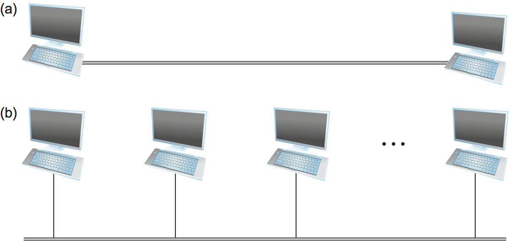
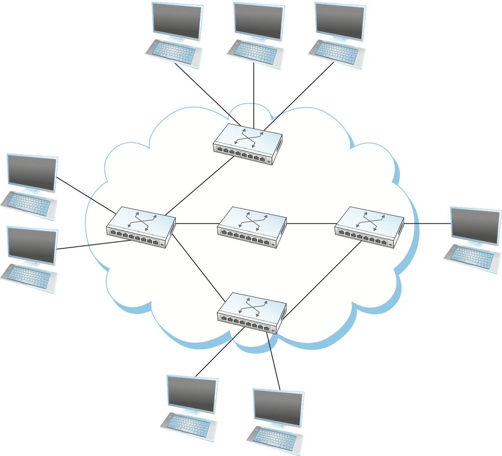
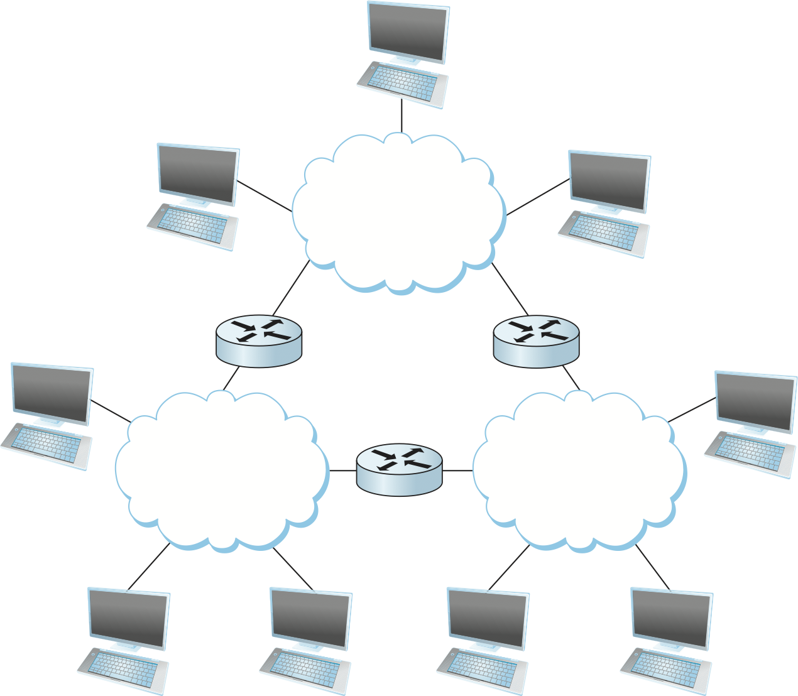
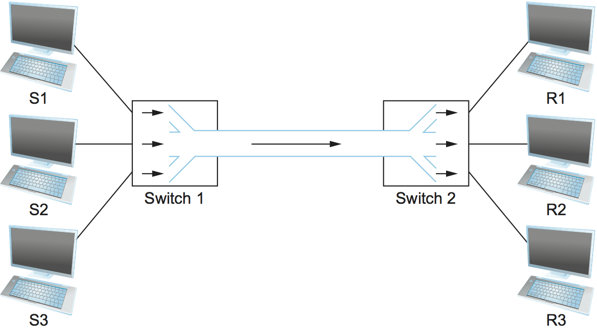
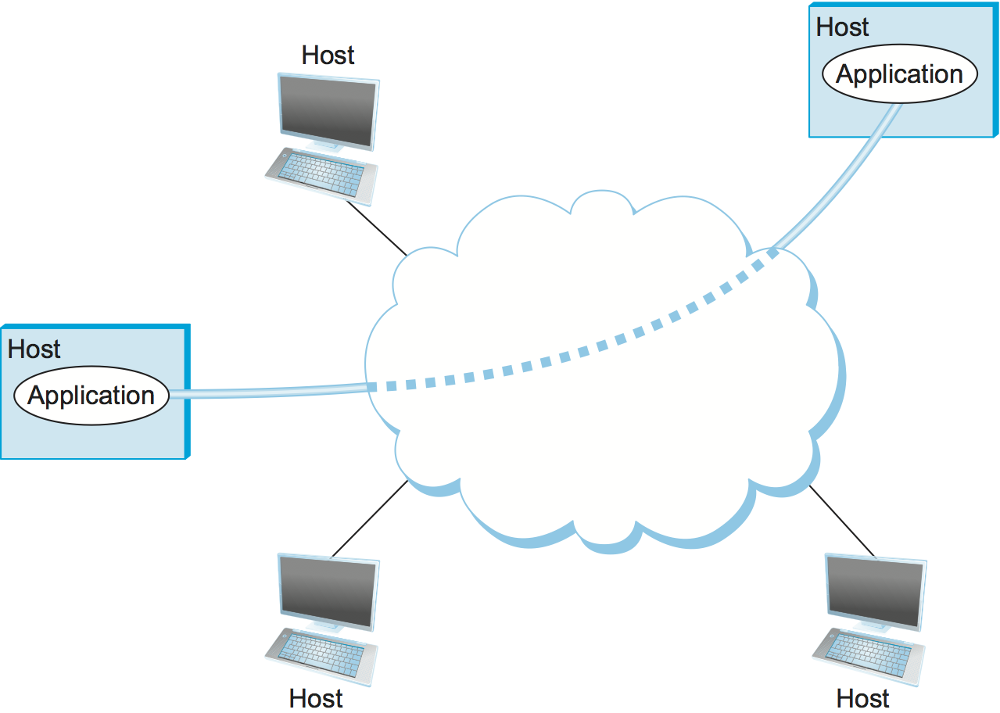

# {{Paj.Toe}}

## 1.2 要求

我们为自己建立了一个雄心勃勃的目标: 了解如何从零开始建立一个计算机网络. 要完成这一目标,我们的方法将从第一原则出发,然后提出我们建立一个实际网络时自然会问的各种问题. 其中每一步,我们使用今天的协议来说明我们可用的各种设计选择, 但我们不会接受现有的这些作为我们的所有. 相反,我们产生疑问 (并回答) 这个问题 - *为什么?*网络是按照他们的方式设计的. 虽然仅仅去理解今天的方式变得很容易,但重要的是了解到基础概念,要知道网络是随着技术发展和新应用而不断改变的. 我们的经验是,一旦你了解了思想的基础, 你遇到的任何新协议都将比较容易消化. 

## 展望

正如我们上面提到的,网络的学生可以从多个角度出发. 我们写这本书的第一版时,大多数人根本没有互联网使用,而那么在工作中,在大学,或在家通过拨号调制解调器进入互联网的人. 当时这些个流行的应用程序数都可以用手指来计算了. 因此,像当时大多数的书籍,我们专注于设计网络设备和协议的人的角度. 现在,我们会继续在这个角度来看,我们的希望是,在读这本书,你将知道如何设计未来的网络设备和协议. 但是,我们也要加大另外两个是越来越重要的角度: 那些开发网络应用程序和那些管理或经营网络的人. 让我们列张表考虑一下,这三个小组对网络有什么需求: 

-   一个*应用程序员*应列出他/她的应用程序需要的服务: 例如,保证应用程序在一定的时间内,发送的每条消息不会出现错误, 或不同的连接时优秀切换网络的能力,保证用户四处走来走去. 

-   一个*网络运营商*应列出一个系统应易于使用和管理的特点: 例如,可以容易分离故障,新的设备正确配置然被添加到网络,并且用法相当简单. 

-   一个*网络设计师*应列出设计成本效益的性能: 例如,网络资源被有效利用,并且公平地分配给不同的用户. 性能问题也很重要. 

本节试图将从这些不同的观点,组合提升, 并作为驱动网络设计的主要考虑事项的高级介绍,并在此过程中确定本书其余部分所要解决的挑战. 

## 可扩展的连接性

从显而易见的情况开始,网络必须提供一组计算机之间的连通性. 有时只需要连接选择的几台机器就可以建立一个有限的网络. 事实上,由于隐私和安全的原因,许多私有 (公司) 网络都有明确的目标,即限制连接的机器数量. 相比之下,其他的网络 (其中互联网是最好的例子) 被设计成一种具有增长潜力的方式, 这个潜力可以允许世界上所有计算机都连接起来. 被设计为支持任意大尺寸的系统增长被称为*规模*. 这本书以互联网为模型,解决了可伸缩性的挑战. 

### 链接,节点和云

为了更全面地理解连接的要求,我们需要更仔细地研究计算机在网络中的连接方式. 连接性发生在许多不同的层次上. 在最低级别上,网络可以由两台或更多台计算机组成,这些计算机由一些物理介质直接连接,例如同轴电缆或光纤. 我们称一个物理介质一个*链接*, 我们经常提到它连接的计算机作为*节点*.  (有时,节点是硬件中更专门的部分,而不是计算机,但是出于讨论的目的,我们忽略了这种区别.) 

观察[图1](#direct),物理链路有时仅链接一对节点 (这样的链路被称为*点对点*,而在其他情况下,多于两个节点可以共享单个物理链路 (这样的链路被称为*多址*) 无线链路,如蜂窝网络和Wi-Fi网络提供的链路,是越来越重要的多址链路. 通常情况下,多址链路的大小是有限的,局限于覆盖的地理距离和可以连接的节点数量. 

<figure class="line">
	<a id="direct"></a>
	
	<figcaption>Direct links 直接连接: (a) point-to-point 点对点; (b) multiple-access. 多址</figcaption>
</figure>

如果考虑计算机网络的所有节点要通过公共物理介质彼此直接连接的情况,那要么网络可以连接的计算机数量非常有限,要么从每个节点的后端出来的线路数量将很快变得既难管理又非常昂贵. 幸运的是,两个节点之间的连接并不一定意味着它们之间需要直接物理连接,也可以通过一组协作节点实现间接连接. 考虑下面两个例子,解释如何间接地连接计算机群. 

[图2](#psn)显示部分节点的集合,每个节点都点到点连接到一个或多个链接. 连接到至少两个链路的那些节点若运行软件,那一个链路上接收数据,再转发到另一个链路上. 如果以系统的方式组织,这些转发节点可形成*交换网络*. 有许多类型的交换网络,其中两种最常见的是*电路交换*和*分组交换*. 前者最值得注意的是被电话系统使用,而后者用于绝大多数计算机网络,并将是本书的重点. (然而,电路交换在光学网络领域有所恢复,随着对网络容量的需求不断增长,这变得很重要. )分组交换网络的重要特征是,这样的节点网络将离散的数据块相互发送. 把这些数据块视为某一应用程序数据 (如一个文件,一封电子邮件或一张图像) 对应的数据块. 我们将每个数据块称为一个*包裹*或一个*消息*, 现在我们可以互换使用这些术语. 

<figure class="line">
	<a id="psn"></a>
	
	<figcaption>Switched network. 交换网络</figcaption>
</figure>

分组交换网络通常使用称为*存储转发*. 顾名思义,存储转发网络中的每个节点首先通过某个链路接收完整的分组,将分组存储在其内部存储器中,然后将完整的分组转发给下一个节点. 相反,电路交换网络首先在一系列链路上建立专用电路,然后允许起点节点通过该电路向目的节点发送比特流. 在计算机网络中使用分组交换,而不是电路交换的主要原因是效率,将在下一小节讨论. 

[图2](#psn)云中,我们区分一下, *实现*网络的内部节点 (通常称为*开关*,它们的主要功能是存储和转发数据包)和云外部的节点*使用*网络 (通常称为*主机*,它们支持用户,运行应用程序). 还要注意,云图标是计算机网络最重要的表现图之一. 通常,我们使用云来表示任何类型的网络,无论是单哥点到点链路,多址链路还是交换网络. 因此,无论何时您看到一个图中使用的云图标,您都可以将它看作本书中涉及的任何网络技术的表达方式. 

> 有趣的是,这种使用云图标的方式早于这个*云计算*术语至少有几十年,但这两种用法之间有联系,我们稍后再讨论. 

<figure class="line">
	<a id="internet-cloud"></a>
	
	<figcaption>Interconnection of networks. 网络互连</figcaption>
</figure>

一组计算机可以间接连接的第二种方式展示在[图3](#internet-cloud). 在这种情况下,一组组独立的网络 (云) 相互连接,形成一个*互联网络*或者简称互联网. 我们采用因特网的惯例,将网络通俗称为小写*i*-互联网, 和当前运用的TCP/IP互联网写为*I*. 连接到两个或多个网络的节点通常称为*路由器*或*网关*,它起到从一个网络转发消息到另一个网络的作用. 请注意,互联网本身可以被视为另一种网络,这意味着互联网可以由一种连接网络来构建. 因此,我们可以通过递归地互连云来构建任意大的网络,以形成更大的云. 我们可以合理认为,这种互连大不相同的网络的想法是因特网根本,因特网可以成功发展到全球规模和数十亿个节点,是早期因特网架构师一些非常好的设计决策的结果.我们稍后再讨论. 

仅仅因为一组主机彼此直接或间接连接,并不意味着我们已经成功地提供了主机到主机的连接. 最终的要求是每个节点必须能够说出它想要与之通信的网络上的其他节点中的哪个节点. 这是通过分配一个*地址*到每个节点. 地址是标识节点的字节字符串; 也就是说,网络可以使用节点的地址将其与连接到网络的其他节点区分开来. 当源节点希望网络向某个目的地节点传递消息时,它指定目的地节点的地址. 如果发送节点和接收节点没有直接连接,则网络的交换机和路由器使用该地址来决定如何将消息转发到目的地. 系统地确定如何根据其地址向目的节点转发消息的过程叫做*路由*.

对寻址和路由的简要介绍, 假定源节点希望向单个目标节点发送消息 (*单播*) 虽然这是最常见的情况,但也可能源节点可能要*广播*消息到网络上的所有节点. 或者,源节点可能希望将消息发送到其他节点的一些子集,但不是全部. *组播*. 因此,除了特定于节点的地址之外,网络的另一个要求是它支持多播和广播地址. 

从这个讨论中获取到的主要思想是,我们可以定义了一个递归的*网络*由物理链路连接的两个或多个节点组成,或由一个节点连接的两个或多个网络组成. 换句话说,网络可由网络嵌套来构造,其中在底层,网络由一些物理介质实现. 在提供网络连接性方面的关键挑战之一, 是定义网络上可到达的每个节点的地址 (包括对广播和多播的支持) ,以及使用这些地址将消息转发到适当的目的地节点. 

## 低成本的资源共享

如上所述,本书着重于分组交换网络. 本节解释计算机网络的关键要求-效率-这导致我们选择分组交换作为策略. 

给定间接连接节点的嵌套网络集合,任何一对主机都可以通过一系列链接和节点相互发送消息. 当然,我们不仅要支持一对通信主机,还要为所有`主机对`提供交换消息的能力. 那么,问题是,所有希望通信的主机如何共享网络,尤其是如果它们希望同时使用它? 而且,如果这个问题还不够困难,那么几个主机是如何共享*链路*的呢, 当他们都想同时使用它的时候?

要了解主机如何共享网络,我们需要介绍一个基本概念,*多路复用*,这意味着系统资源在多个用户之间共享. 在直观的层次上,多路复用可以通过类比于 *分时计算机系统* 来解释,其中单个物理处理器在多个作业之间共享 (多路复用) ,每个作业都认为它具有自己的专用处理器. 类似地,由多个用户发送的数据可以在构成网络的物理链路上复用. 

若要了解这可能如何工作,请考虑[图4](#mux)其中,网络的左侧的三个主机(发送者S1-S3), 通过共享仅包含一个物理链路的交换网络, 向右侧的三个主机(接收者R1-R3)发送数据. (为了简单起见,假设主机S1正在向主机R1发送数据,然后.)在这种情况下,与三对主机对应的三个数据流通过`Switch 1`被复用到单个物理链路上,然后通过`Switch 2`*解复用*返回到单独的流中. 请注意,我们故意模糊了"数据流"对应的内容. 为了便于讨论,假设左侧的每个主机有大量数据要发送给右侧的对应机. 

<figure class="line">
	<a id="mux"></a>
	
	<figcaption>Multiplexing multiple logical flows over a single
	physical link. 在单个物理链路上复用多个逻辑流。</figcaption>
</figure>

有多种不同的方法将多个流复用到一个物理链路上. 一种常用的方法是*同步分时多路复用* (STDM) . STDM的思想是将时间划分为大小相等的量子,并以循环方式,为每个流提供通过物理链路发送数据的机会. 换句话说,在 时间量子`-1` 期间,S1到R1的数据被传输;在 时间量子`-2` 期间, S2到R2的数据被传输;在 `-3` 中,S3将数据发送到R3. 此时,第一流 (S1至R1) 再次开始,并且该过程重复. 另一种方法是*分频复用* (FDM) . FDM的思路是在物理链路上,以不同频率传输每个流,这与在无线电波上或在同轴有线电视链路上,以不同频率传输不同电视台的信号大致相同. 

<!-- 翻译到这里 -->

虽然简单易懂,STDM和FDM都以两种方式受到限制. 首先,如果其中一个流 (主机对) 没有任何数据要发送,则其物理链路的份额 (即,其时间量或其频率) 保持空闲,即使其他流之一有数据要发送. 例如,在S1和S2没有发送的情况下,S3不得不在前面段落中等待S1和S2的后面. 对于计算机通信,链接空闲的时间量可能非常大ℴℴ例如,考虑与获取页面的时间相比,您阅读网页 (使链接空闲) 所花费的时间量. 第二,STDM和FDM都局限于最大流量的固定和提前知道的情况. 在STDM的情况下调整量子的大小或添加额外的量子或在FDM的情况下添加新的频率是不实际的. 

解决这些缺点的复用形式,我们在这本书中最常用的形式叫做*统计复用*. 尽管这个名称对理解这个概念没有多大帮助,但是统计复用实际上非常简单,有两个关键思想. 首先,它类似于STDM,因为物理链路是随时间共享的ℴℴ来自一个流的数据首先在物理链路上传输,然后来自另一个流的数据被传输,等等. 然而,与STDM不同的是,数据是按需传输的,而不是在预定的时隙中传输的. 因此,如果只有一个流有数据要发送,那么它就可以在不等待其量子到来的情况下发送该数据,从而不必观看分配给其他流的量子未被使用. 正是这种避免空闲时间给分组交换的效率. 

然而,如到目前为止所定义的,统计复用没有机制来确保所有流最终通过物理链路进行传输. 也就是说,一旦流开始发送数据,我们需要某种方式来限制传输,以便其他流可以有一个回合. 为了满足这种需要,统计复用定义了数据块大小的上限,每个流在给定时间被允许传输. 这种有限大小的数据块通常被称为"A". *小包裹*把它与任意大的区别开来*消息*一个应用程序可能需要传输. 因为分组交换网络限制了分组的最大大小,所以主机可能不能在一个分组中发送完整的消息. 源可能需要将消息分割成几个分组,接收机将分组重新组装回原始消息. 

换言之,每个流在物理链路上发送分组序列,并基于分组逐个做出关于接下来要发送哪个流的分组的决定. 注意,如果只有一个流需要发送数据,那么它可以背对背地发送一系列数据包;但是,如果多个流需要发送数据,则它们的数据包在链路上交错. 描述将多个源的分组复用到单个共享链路上的切换. 

关于在共享链路上发送下一个分组的决定可以通过多种不同的方式来实现. 例如,在由交换机互连的网络中[图4](#mux)这个决定是由将数据包传输到共享链路上的交换机作出的.  (正如我们稍后将看到的,并非所有分组交换网络实际上都涉及交换机,并且它们可以使用其他机制来确定谁的分组接下来进入链路. ) 分组交换网络中的每个交换机都基于分组逐个独立地作出这个决定. 网络设计者面临的一个问题是如何公平地做出这一决定. 例如,交换机可以被设计为在第一入先出 (FIFO) 基础上服务分组. 另一种方法是以循环方式从当前通过交换机发送数据的每个不同流发送分组. 这可以确保某些流接收到链路带宽的特定份额,或者确保它们的分组在交换机中永远不会延迟超过一定时间. 试图分配带宽到特定流的网络有时被称为支持. *服务质量* (QoS) ,我们在第6章返回的话题. 

此外,请注意[图4](#mux)由于交换机必须将三个传入分组流复用到一个传出链路上,所以交换机接收分组的速度可能快于共享链路所能容纳的速度. 在这种情况下,交换机被迫在其存储器中缓冲这些分组. 如果交换机接收数据包的速度快于发送数据包的速度,那么交换机最终将耗尽缓冲空间,并且一些数据包将不得不丢弃. 当开关在这种状态下运行时,据说它是*拥挤的*.

底线是统计复用为多个用户 (例如,数据的主机到主机流) 以细粒度方式共享网络资源 (链接和节点) 定义了一种成本效益高的方法. 它将分组定义为网络的链路分配给不同流的粒度,每个交换机能够根据每个分组来调度它所连接的物理链路的使用. 公平地分配链路容量给不同的流,并且当拥塞发生时处理拥塞是统计复用的关键挑战. 

## 支持公共服务

上一节概述了在一组主机之间提供具有成本效益的连接性所涉及的挑战,但是将计算机网络看作简单地在计算机集合之间传送分组过于简单. 将网络看作提供分布在这些计算机上的一组应用程序进程进行通信的手段更为准确. 换句话说,计算机网络的下一个要求是在连接到网络的主机上运行的应用程序必须能够以有意义的方式通信. 从应用开发者的角度来看,网络需要使他或她的生活更容易. 

当两个应用程序需要彼此通信时,除了简单地从一个主机向另一个主机发送消息之外,还必须发生许多复杂的事情. 一种选择是应用程序设计者将所有复杂的功能构建到每个应用程序中. 然而,由于许多应用程序需要公共服务,因此一次实现这些公共服务然后让应用程序设计人员使用这些服务构建应用程序更加合乎逻辑. 网络设计者面临的挑战是识别正确的公共服务集合. 其目的是在不过度限制应用程序设计器的情况下,从应用程序隐藏网络的复杂性. 

<figure class="line">
	<a id="channel"></a>
	
	<figcaption>Processes communicating over an abstract channel.</figcaption>
</figure>

直观地说,我们认为网络是提供逻辑的. *渠道*每个通道提供应用程序所需的服务集. 换句话说,正如我们使用云抽象地表示一组计算机之间的连接性一样,我们现在将通道视为将一个进程连接到另一个进程. [图5](#channel)显示了一对通过逻辑通道进行通信的应用程序级进程,逻辑通道又反过来在连接一组主机的云上实现. 我们可以认为通道就像连接两个应用程序的管道,因此发送应用程序可以将数据放在一端,并期望数据通过网络传递到管道另一端的应用程序. 

面临的挑战是要认识到频道应该为应用程序提供什么功能. 例如,应用程序是否需要确保通过通道发送的消息被传递,或者如果某些消息未能到达,是否可以接受?消息到达收件人进程的顺序是否必须与它们发送的顺序相同,或者收件人不关心消息到达的顺序?网络是否需要确保没有第三方能够窃听该频道,或者隐私不是一个问题?通常,网络提供各种不同类型的通道,每个应用程序选择最能满足其需要的类型. 本节的其余部分说明了在定义有用的通道时所涉及的思想. 

### 识别常见的通信模式

设计抽象通道首先需要理解一组具有代表性的应用程序的通信需求,然后提取它们的公共通信需求,最后将满足这些需求的功能合并到网络中. 

在任何网络上支持的最早的应用程序之一是文件访问程序,如文件传输协议 (FTP) 或网络文件系统 (NFS) . 尽管许多细节不同,例如,整个文件是通过网络传输的,还是在给定时间只读/写文件的单个块,远程文件访问的通信组件具有一对进程的特征,一个进程请求读取文件或wRITTEN和第二个过程,尊重这一要求. 请求访问文件的过程称为*客户机*并且支持访问文件的过程称为*服务器*.

读取文件涉及客户机向服务器发送小请求消息,而服务器则使用包含文件中数据的大消息进行响应. 写操作的方式相反ℴℴ客户机向服务器发送包含要写入的数据的大消息,而服务器则以确认对磁盘的写入已经发生的小消息作出响应. 

数字图书馆是比文件传输更复杂的应用,但它需要类似的通信服务. 例如,*计算机械协会* (ACM) 经营一个大型的计算机科学文献数字图书馆. 

```pseudo
http://portal.acm.org/dl.cfm
```

这个库具有广泛的搜索和浏览功能,以帮助用户找到他们想要的文章,但是它最终所做的大部分工作都是响应用户对文件的请求,例如期刊文章的电子副本,非常类似于FTP服务器. 

使用文件访问,数字图书馆和介绍中描述的两个视频应用程序 (视频会议和视频点播) 作为代表性示例,我们可能决定提供以下两种类型的频道: *请求/应答*渠道和*消息流*渠道. 请求/应答信道将被文件传输和数字图书馆应用所使用. 它将保证一方发送的每条消息都由另一方接收,并且每个消息的副本仅被传递. 请求/应答通道还可保护流经其上的数据的隐私和完整性,使得未经授权的当事方不能读取或修改在客户端和服务器进程之间交换的数据. 

消息流信道可以被视频点播和视频会议应用两者使用,只要它被参数化以支持单向和双向业务以及支持不同的延迟特性. 消息流信道可能不需要保证所有消息都被传送,因为即使没有接收到一些视频帧,视频应用程序也可以充分地操作. 然而,它需要确保被传递的消息以相同的顺序到达,从而避免显示帧的顺序失调. 与请求/应答信道一样,消息流信道可能希望确保视频数据的保密性和完整性. 最后,消息流信道可能需要支持多播,以便多方可以参加电话会议或观看视频. 

虽然对于网络设计人员来说,争取能够为最大数量的应用程序服务的最少数量的抽象通道类型是常见的,但是试图摆脱通道抽象太少的情况是危险的. 简单地说,如果你有一把锤子,那么所有的东西都看起来像钉子. 例如,如果仅有消息流和请求/应答通道,则很有可能将它们用于接下来出现的应用程序,即使这两种类型都不提供应用程序所需的语义. 因此,只要应用程序员发明新的应用程序,网络设计者可能会发明新型的通道,并向现有通道添加选项. 

还要注意的是精确的独立性. *什么*一个给定的通道提供的功能,有一个问题*哪里*实现了该功能. 在许多情况下,最简单的是查看主机以简单地提供底层网络来连接底层网络. *钻头管*,在终端主机上提供任何高级通信语义. 这种方法的优点是,它使交换机在网络中间尽可能简单,它们只是转发分组,但它要求终端主机承担支持语义丰富的进程到进程通道的大部分负担. 另一种选择是将附加功能推到开关上,从而允许终端主机是"哑"设备 (例如,电话手机) . 我们将看到这样的问题,即分组交换机和终端主机 (设备) 之间如何划分各种网络服务,这是网络设计中经常出现的问题. 

### 可靠性

正如刚才所考虑的示例所建议的,可靠的消息传递是网络可以提供的最重要的功能之一. 然而,如果不首先理解网络如何失效,就很难确定如何提供这种可靠性. 首先要认识到的是,计算机网络并不存在于一个完美的世界中. 机器崩溃,然后重新启动,光纤被切断,电干扰损坏正在传输的数据中的位,开关耗尽缓冲空间,并且,好像这些类型的物理问题还不够令人担心的,管理硬件的软件可能包含bug,有时ES将包转发到湮没中. 因此,网络的主要需求是从某些类型的故障中恢复,以便应用程序不必处理它们,甚至不必知道它们. 

网络设计者需要担心的故障有三大类. 首先,当数据包通过物理链路传输时,*位误差*可以将数据导入到数据中,即1变成0或*反之亦然*. 有时,单个位被破坏,但往往不是*突发错误*发生多个连续位损坏. 位错误通常由于外部力 (如雷击,电涌和微波炉) 干扰数据传输而发生. 好消息是,这种位错误相当罕见,在典型的铜基电缆上,平均每10美元^6美元到10美元^7美元位中仅影响一个位,在典型的光纤上,每10美元^{12}$$到10美元^{14}$位中仅影响一个位. 正如我们所看到的,有一些技术可以很好地检测这些位错误. 一旦检测到,有时可以纠正这样的错误ℴℴ如果我们知道哪些位或位被损坏,我们可以简单地翻转它们ℴℴ而在其他情况下,损坏是如此严重,以至于必须丢弃整个分组. 在这种情况下,发送者可以预期重传该分组. 

第二类故障是在分组,而不是比特级,即,网络丢失了完整的分组. 这可能发生的一个原因是该包包含一个不可纠正的位错误,因此必须被丢弃. 然而,更可能的原因是,必须处理分组的节点之一ℴℴ例如,将分组从一个链路转发到另一个链路的交换机ℴℴ负载过重,以至于它没有地方存储分组,因此被迫丢弃分组. 这就是刚才讨论的拥塞问题. 不太常见的是,在一个处理分组的节点上运行的软件出错. 例如,它可能错误地将数据包转发到错误的链路上,从而使数据包永远不会找到到达最终目的地的路. 正如我们将看到的,处理丢失分组的主要困难之一是区分确实丢失的分组与仅仅到达目的地晚的分组. 

第三类故障在节点和链接级别;也就是说,物理链接被切断,或者它连接的计算机崩溃. 这可能是由软件崩溃,电源故障,或鲁莽的反铲操作员. 由于网络设备的错误配置导致的故障也是常见的. 虽然这些故障中的任何一个最终都能够被纠正,但是它们可能在很长一段时间内对网络产生戏剧性的影响. 然而,它们不需要完全禁用网络. 例如,在分组交换网络中,有时可能绕过一个失败的节点或链路. 处理这第三类故障的困难之一是区分出故障计算机和仅是慢速的计算机,或者在链路的情况下,区分已切断的计算机和非常片状的计算机,从而引入大量位错误. 

从这个讨论中得出的关键思想是,定义有用的通道既包括理解应用程序的需求,也包括认识到底层技术的局限性. 面临的挑战是填补应用程序期望和底层技术所能提供的差距. 这有时被称为*语义鸿沟. *

## 可管理性

最后一个要求是,网络需要管理,而这个要求似乎被忽略了,或者一直持续到最后 (就像我们在这里所做的那样) . 管理网络包括随着网络的增长进行更改以承载更多的流量或接触更多的用户,以及当出现问题或性能不佳时对网络进行故障排除. 

这一要求部分与上面讨论的可伸缩性问题有关,因为因特网已经扩展到支持数十亿用户和至少数亿台主机,因此在添加新设备时保持整个系统正确运行和正确配置新设备的挑战也随之而来. 变得越来越有问题. 在网络中配置单个路由器通常是训练有素的专家的任务;配置成千上万个路由器,并弄清楚为什么这样一个规模的网络没有如预期的那样运行,可能成为超越任何单个人的任务. 此外,为了使网络的操作具有可伸缩性和成本效益,网络运营商通常要求许多管理任务被自动化或至少由相对不熟练的人员执行. 

自从我们写这本书的第一版以来,网络方面的一个重要发展就是,家庭网络已经司空见惯了. 这意味着,网络管理不再是专家的专长,而是需要由消费者通过很少甚至没有特殊培训来完成. 这有时被描述为网络设备应该是"即插即用"的要求,而这个目标已经被证明是相当难以实现的. 稍后我们将讨论一些解决这个需求的方法,但是现在值得注意的是,提高网络的可管理性仍然是当前研究的一个重要领域,如果不是*这个*当今网络的中心挑战. 
